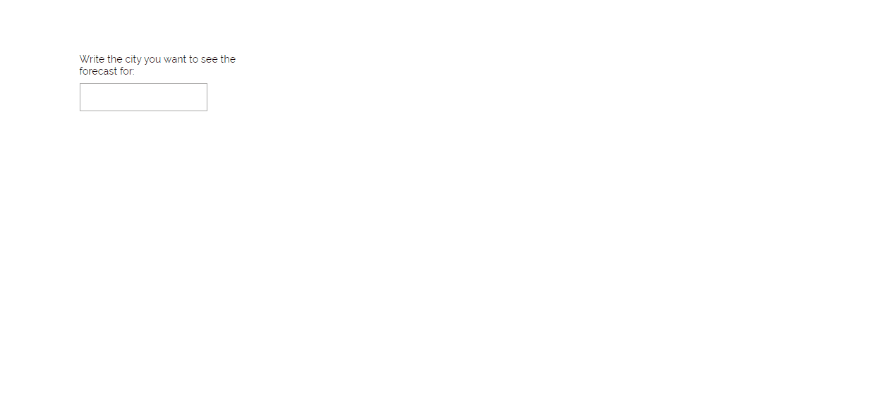

# Weather forecast application

This is a website that allows you to search for forecasts of any city for up to 5 days.

## How to start

All required packages are already in the project. To start the project type in the script command `npm start` while being in the porject directory  
This will open [http://localhost:3000](http://localhost:3000) to view the website in the browser.

## Functionalities
 
* You can type in the city you seek to know the forecast of
* If the city exists, an option of selecting a country and gps location will appear (***These options are required as a city can have the same name, but be in different countries, for this, an option of multiple selections allows us to specify which specific city we want to see the results of***)
* You can look up over 200000 cities forecasts
* You can see the temperature changes every 3 hours and you can hover over a point to see the specific time clearer
***due to API restrictions more frequent or longer forecasts could not be done***

## Examples of use

***Looking up forecats***

## Technologies

This web application was implemented using:
1. ReactJSX - projects framework
2. CanvasJS - for displaying data in a graphical way [CanvasJs](https://canvasjs.com/react-charts/)
3. scss - for styling components while upholding the BEM styling rules
4. Weather API - for fetching forecast data and getting city data list

## Other information

[Weather API Guidelines](https://openweathermap.org/guide)
[Weather API city ID list](https://openweathermap.org/current#cityid)
